# CyberShield — Multi-Class Cyberbullying Detection

An end-to-end NLP system that detects and classifies cyberbullying in social media text — not just *whether* a post is harmful, but *which type* of harassment it represents. Built on ~47,700 labeled tweets, comparing classical ML (TF-IDF + Logistic Regression/SVM/Naive Bayes) against a fine-tuned RoBERTa transformer, with SHAP/LIME explainability and a deployed REST API + web demo.

**Classes:** `age`, `ethnicity`, `gender`, `religion`, `other_cyberbullying`, `not_cyberbullying`

## Overview

The pipeline covers:

1. **EDA** — class balance, text length distribution, word clouds, and top n-grams per category.
2. **Preprocessing** — lowercasing, URL/mention removal, hashtag normalization, punctuation/digit stripping, stopword removal, lemmatization, short-token removal; stratified 70/15/15 train/val/test split (seed 42).
3. **Classical ML** — TF-IDF (up to 50k features, 1–2 grams, sublinear TF) piped into Logistic Regression, Linear SVM, and Multinomial Naive Bayes, with grid-search hyperparameter tuning on the best performer.
4. **Transformer model** — `roberta-base` fine-tuned for multi-class sequence classification.
5. **Evaluation** — confusion matrices and weighted F1/accuracy for every model.
6. **Explainability** — SHAP (global feature importance) and LIME (per-instance explanations) on the classical model.
7. **Deployment** — a FastAPI REST API serving both the classical and transformer models, plus a static web front end (`index.html`) for interactive predictions.

## Repository Contents

| File / Folder | Description |
|---|---|
| `EDA.ipynb` | Class distribution, text length analysis, word clouds, n-grams. |
| `preprocessing.ipynb` | Text cleaning and train/val/test split. |
| `classical-models.ipynb` | TF-IDF + Logistic Regression / SVM / Naive Bayes, hyperparameter tuning. |
| `transformer-model.ipynb` | RoBERTa fine-tuning, training loop, evaluation. |
| `explainability.ipynb` | SHAP and LIME analysis. |
| `app.py` | FastAPI backend serving predictions from both models. |
| `index.html` | Web front end for the API (CyberShield demo UI). |
| `best_classical_model.pkl`, `tuned_lr_model.pkl`, `label_encoder.pkl` | Saved classical model artifacts. |
| `roberta_best/` | Fine-tuned RoBERTa config + tokenizer (model weights excluded — see below). |
| `cyberbullying_tweets.csv`, `cyberbullying_eda.csv` | Raw and EDA-processed dataset. |
| `train.csv`, `val.csv`, `test.csv` | Stratified splits used for modeling. |
| `NLP_Report_CyberShield.docx` | Full written report. |
| `CyberShield_Professional.pptx` | Project presentation deck. |
| `visuals/` | All charts and screenshots referenced below (EDA, model evaluation, explainability, deployment). |

## ⚠️ Model Weights Not Included

`roberta_best/model.safetensors` (**~476 MB**) is **not included in this repo** — it exceeds GitHub's 100 MB per-file limit. The folder still contains `config.json`, `tokenizer.json`, and `tokenizer_config.json`.

To run the transformer model locally:
1. Re-run `transformer-model.ipynb` to train and save it yourself, **or**
2. Download the trained weights from **[add your hosting link here — e.g. Hugging Face Hub, Google Drive]** and place `model.safetensors` inside `roberta_best/`.

The classical model (`tuned_lr_model.pkl`, ~2.6 MB) is included and works out of the box without this step.

## Dataset

- Source: [Cyberbullying Classification dataset, Kaggle](https://www.kaggle.com/datasets/andrewmvd/cyberbullying-classification)
- ~47,700 tweets, approximately balanced across 6 classes (7,800–8,000 samples each).

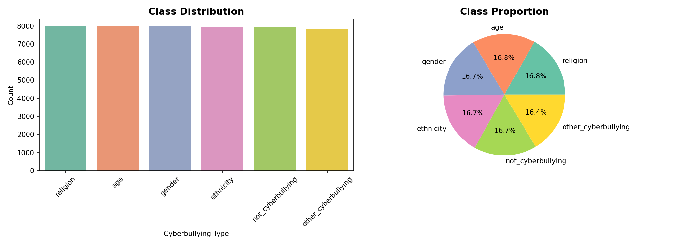

## Requirements

```
pandas
numpy
matplotlib
seaborn
scikit-learn
nltk
wordcloud
torch
transformers
shap
lime
tqdm
joblib
fastapi
uvicorn
pydantic
```

Install with:
```bash
pip install -r requirements.txt
```

You'll also need to download NLTK data once:
```python
import nltk
nltk.download('stopwords')
nltk.download('wordnet')
nltk.download('punkt')
```

## Running

### 1. Set up the environment

```bash
cd cybershield-repo
python -m venv venv
source venv/bin/activate      # Windows: venv\Scripts\activate
pip install -r requirements.txt
```

Then download the NLTK data the preprocessing needs:
```bash
python -c "import nltk; nltk.download('stopwords'); nltk.download('wordnet'); nltk.download('punkt')"
```

### 2. Get the RoBERTa model weights

`roberta_best/model.safetensors` isn't in this repo (see [Model Weights Not Included](#️-model-weights-not-included) above). Either:
- Re-run `transformer-model.ipynb` to train and save it yourself, or
- Download it from wherever you've hosted it and drop it into `roberta_best/`, next to the existing `config.json` / `tokenizer.json`.

The classical model (`tuned_lr_model.pkl`) works without this step — if you just want to test quickly, use `"model": "classical"` in requests (see below) and skip this.

### 3. Run the API

```bash
uvicorn app:app --reload
```

This starts the FastAPI server at `http://127.0.0.1:8000`. Check it's alive at `http://127.0.0.1:8000/docs` for an interactive Swagger UI where you can test `/predict` directly.

Example request body for `/predict`:
```json
{
  "text": "some tweet text here",
  "model": "classical"
}
```
(use `"model": "roberta"` once you've added the weights)

### 4. Run the front end

`index.html` is a static file — no server needed for it specifically, but it calls the API, so the API must already be running (step 3). Just open it directly:

```bash
# macOS
open index.html
# Windows
start index.html
# Linux
xdg-open index.html
```

Or double-click it in your file explorer. If predictions fail to load, check the browser console — it's almost always either the API not running, or a CORS/URL mismatch if `index.html` is pointed at a different host/port than `127.0.0.1:8000`.

### Notebooks

Run in order to reproduce the full pipeline: `EDA.ipynb` → `preprocessing.ipynb` → `classical-models.ipynb` → `transformer-model.ipynb` → `explainability.ipynb`.

## Text Analysis

Word clouds and n-gram frequency by category, and tweet length distribution:

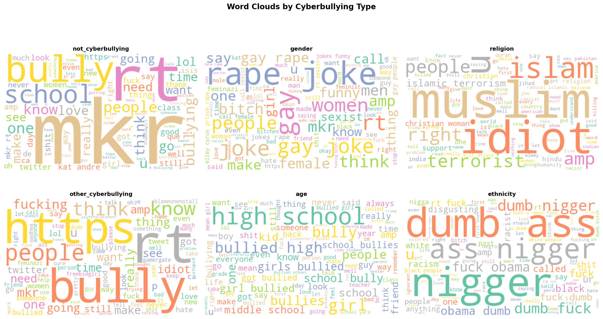
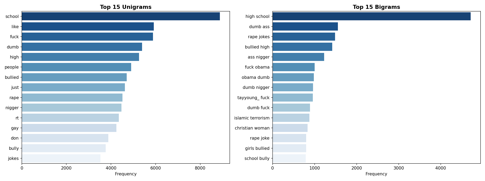
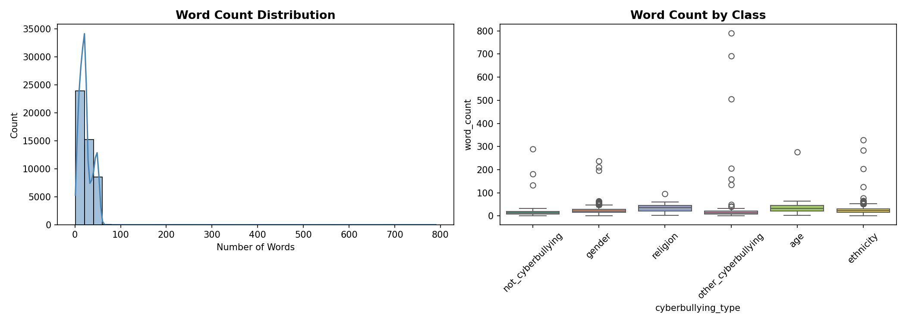

## Model Development & Evaluation

### Classical Models (TF-IDF)

Three classical pipelines were trained and compared on the held-out test set (7,088 tweets):

| Model | Test Accuracy | Test F1 (weighted) |
|---|---|---|
| Multinomial Naive Bayes | 0.761 | 0.747 |
| Linear SVM | 0.816 | 0.815 |
| **Logistic Regression** | **0.822** | **0.822** |
| Logistic Regression (tuned) | — | 0.821 |

Logistic Regression was selected as the best classical model; grid search over `C`, TF-IDF `max_features`, and n-gram range confirmed the untuned configuration was already close to optimal (best CV F1 = 0.821).

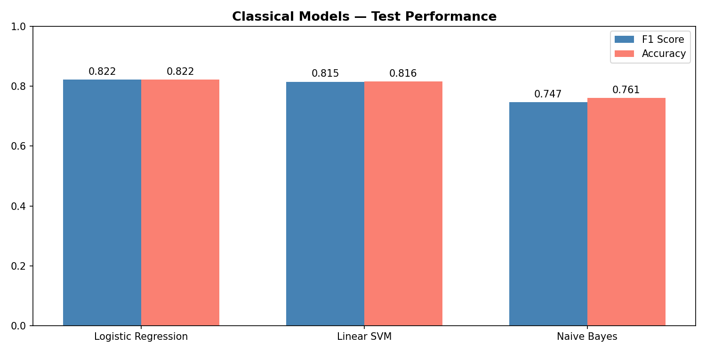
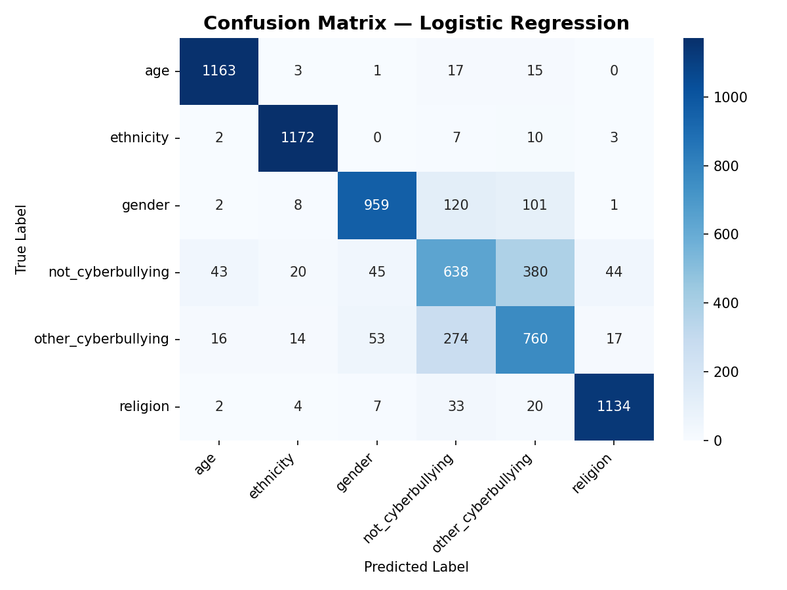

All classical models score highest on `age`, `ethnicity`, and `religion` (F1 ≈ 0.85–0.97) — these categories tend to use distinctive vocabulary. `not_cyberbullying` and `other_cyberbullying` are consistently the hardest to separate (F1 ≈ 0.47–0.63), since "other" is a catch-all category and normal text can overlap with borderline harassment.

### Transformer Model (Fine-tuned RoBERTa)

`roberta-base` was fine-tuned for 4 epochs with early stopping on validation F1:

| Metric | Value |
|---|---|
| Test Accuracy | 0.85 |
| Test F1 (weighted) | 0.844 |

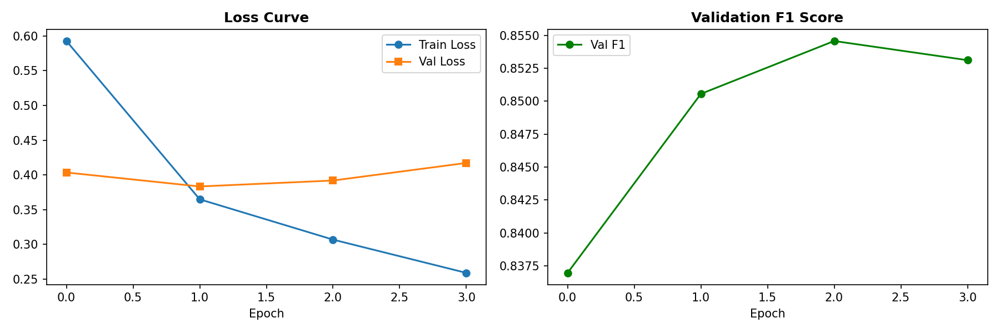
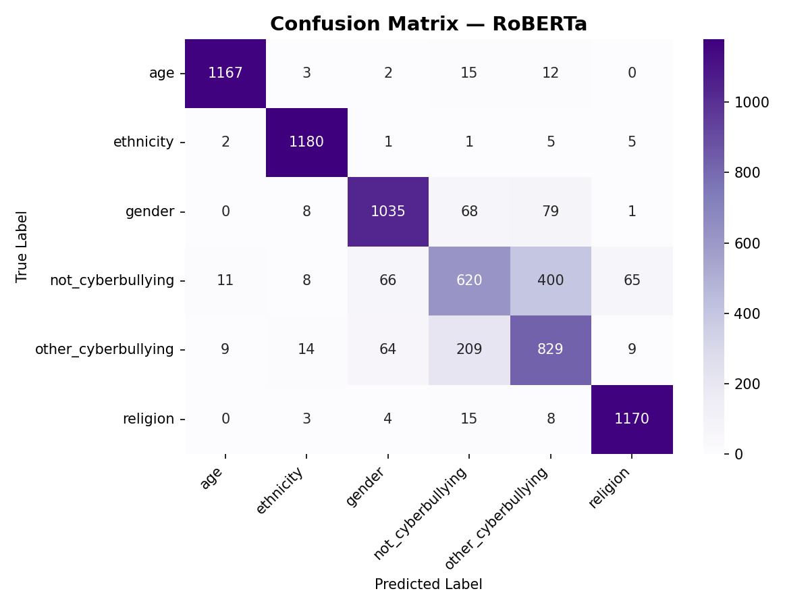

RoBERTa improves meaningfully over the best classical model on the hardest classes — `other_cyberbullying` F1 rises from 0.63 to 0.67 and `gender` from 0.85 to 0.88 — by capturing context that bag-of-words TF-IDF features miss, while the easier classes (`age`, `ethnicity`, `religion`) were already well handled by both approaches.

## Explainability

**SHAP** (global feature importance for the classical model) and **LIME** (per-instance explanations) were used to interpret predictions and check for potential bias across demographic-adjacent categories:

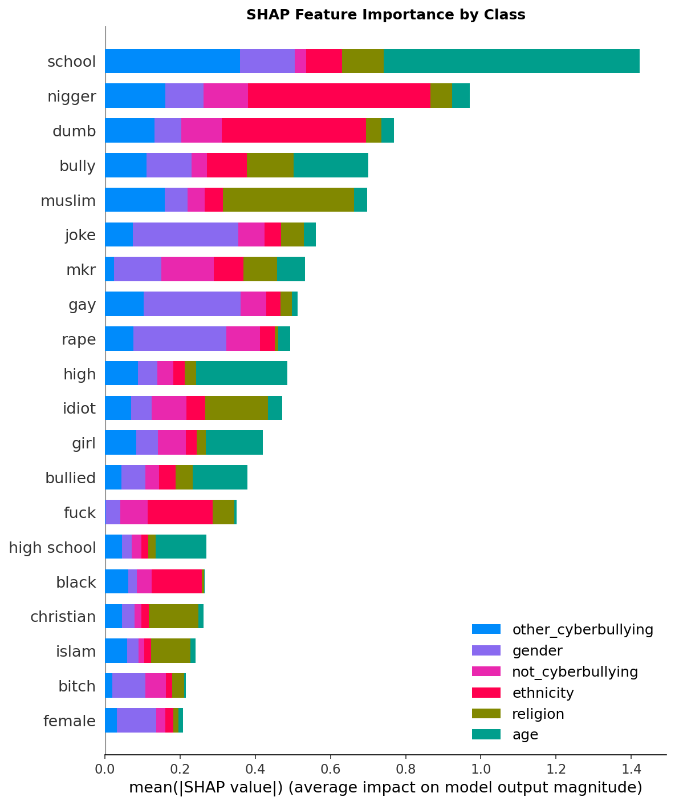
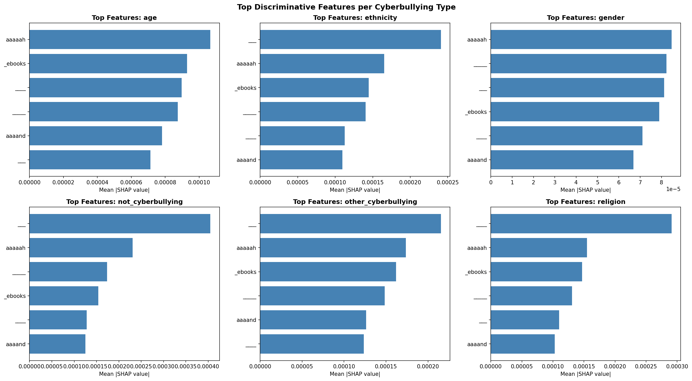
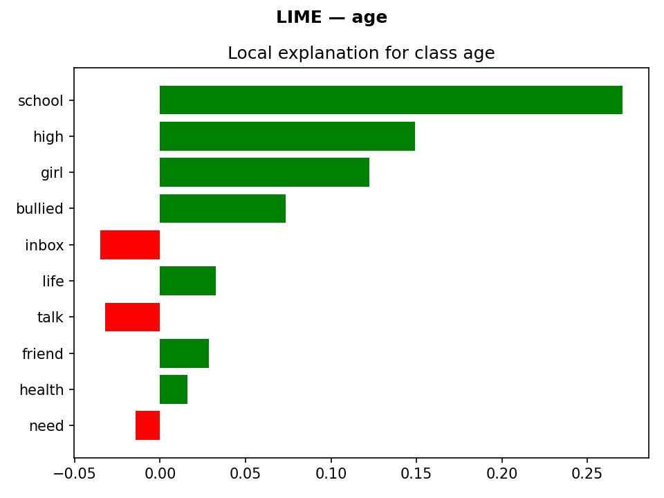
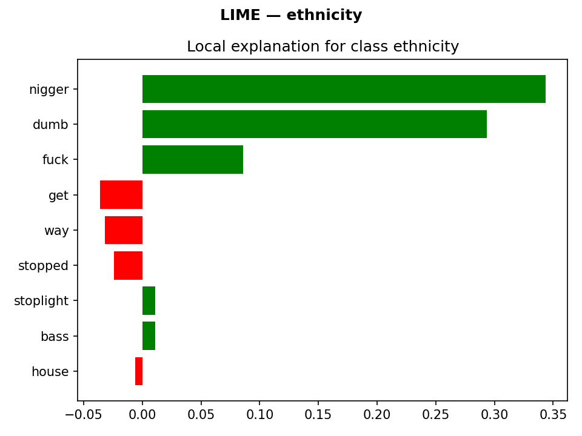
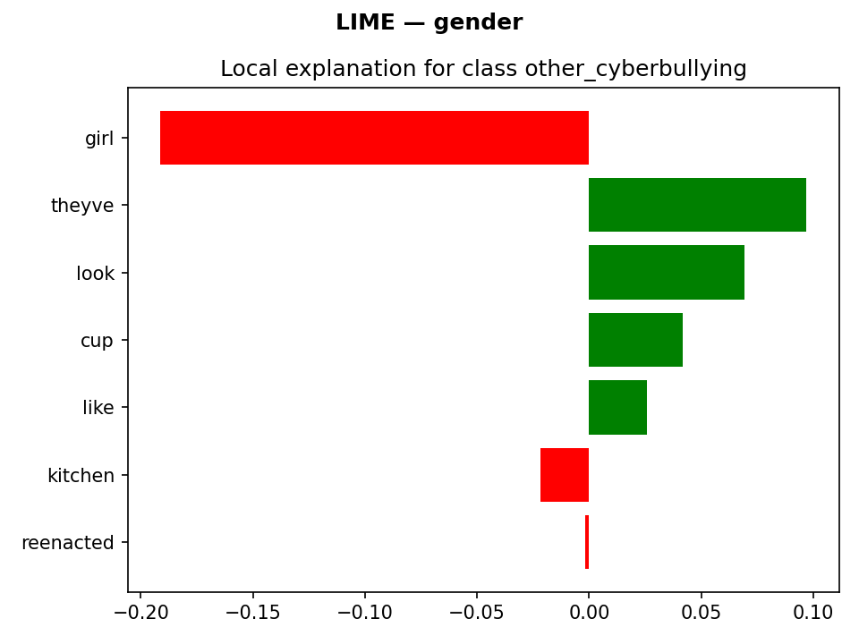

## Deployment

The best-performing models are served through a FastAPI backend (`app.py`) with `/predict`, `/classes`, and `/health` endpoints, plus a static web front end for interactive testing:

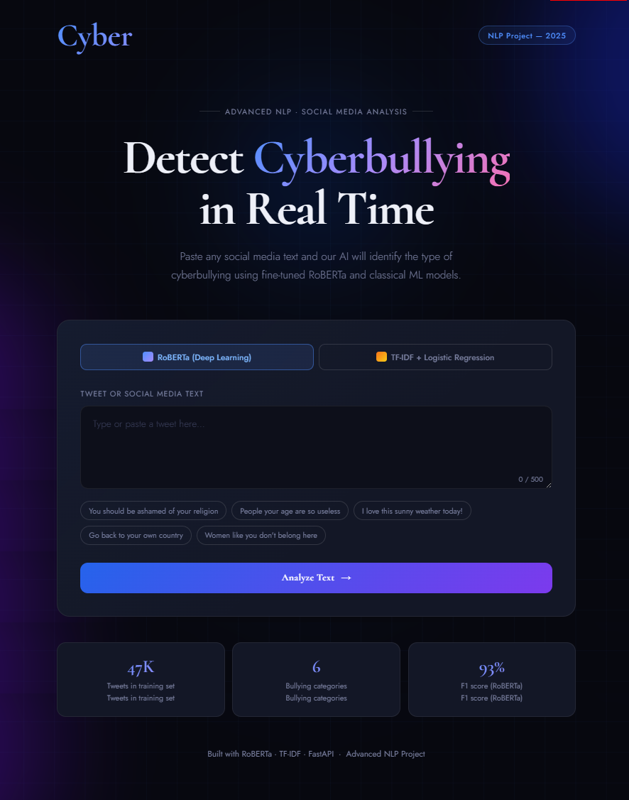
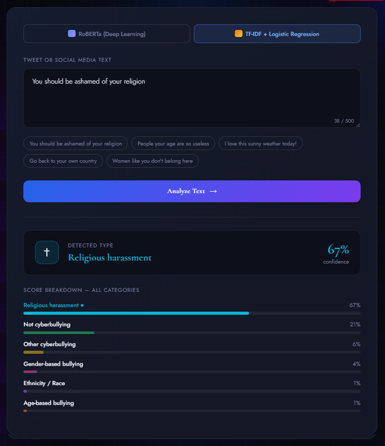
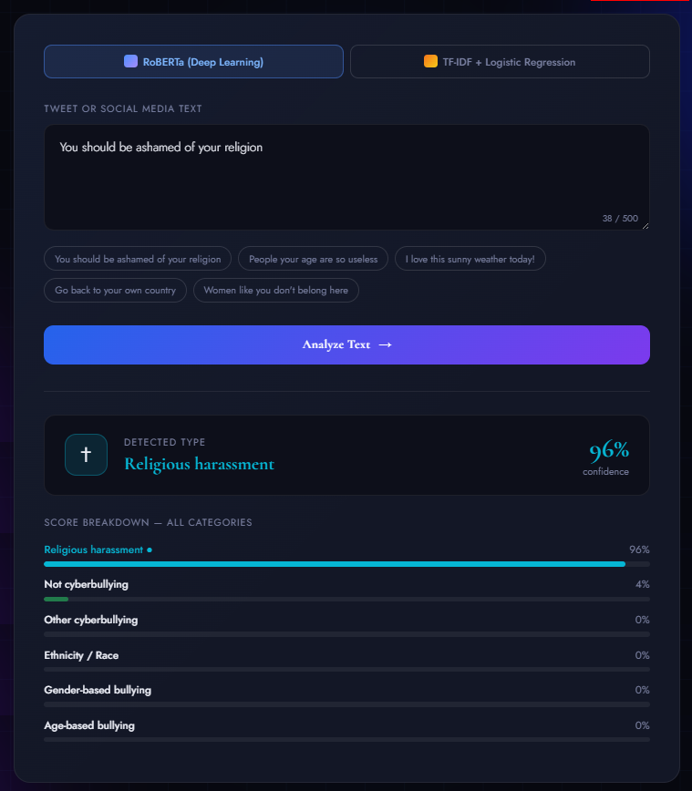

## Ethical Considerations

Because several class labels (`age`, `ethnicity`, `gender`, `religion`) name demographic categories rather than being purely content-based, the project's explainability analysis specifically checks that predictions key off harassing *language* rather than the mere mention of a protected group — e.g. that a sentence naming an ethnicity isn't flagged as harassment by default. See `NLP_Report_CyberShield.docx` (§11) for the full discussion of bias detection, fairness, and responsible use.

## Key Findings

- The dataset is well-balanced across all 6 classes (~7,800–8,000 tweets each), so no resampling was needed.
- Logistic Regression on TF-IDF was the strongest classical model (82.2% accuracy, 0.822 weighted F1) — extensive hyperparameter tuning gave negligible further improvement.
- Fine-tuned RoBERTa outperformed all classical models overall (85% accuracy, 0.844 weighted F1), with its biggest gains on the hardest, most context-dependent classes (`other_cyberbullying`, `gender`).
- `not_cyberbullying` vs. `other_cyberbullying` is the persistent failure mode across every model — both are effectively catch-all classes with more diffuse vocabulary than the four named-harassment categories.
- SHAP/LIME explainability was used specifically to check that the model targets harassing language rather than group identity terms alone.
